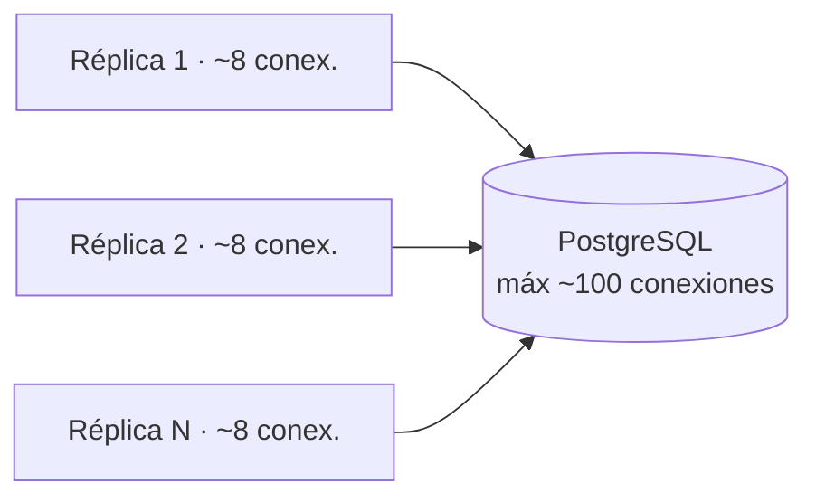
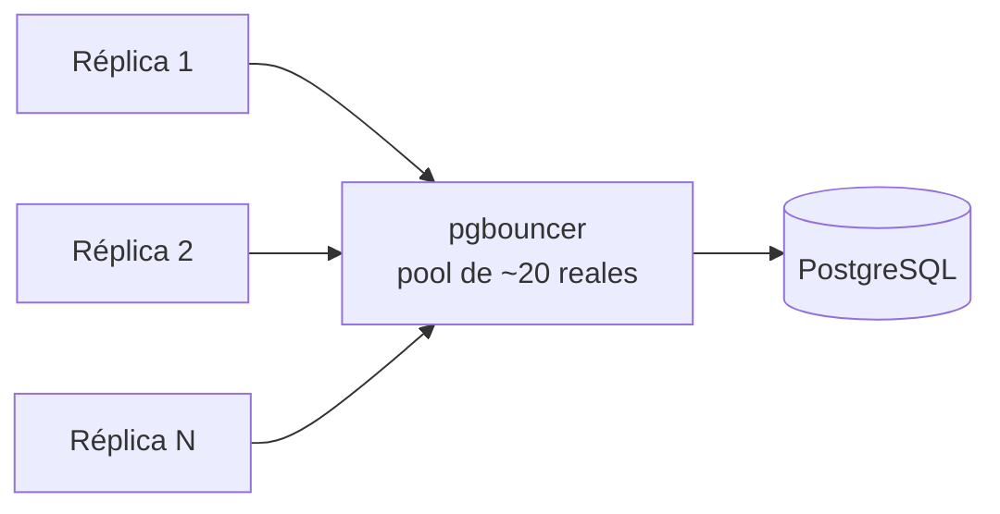
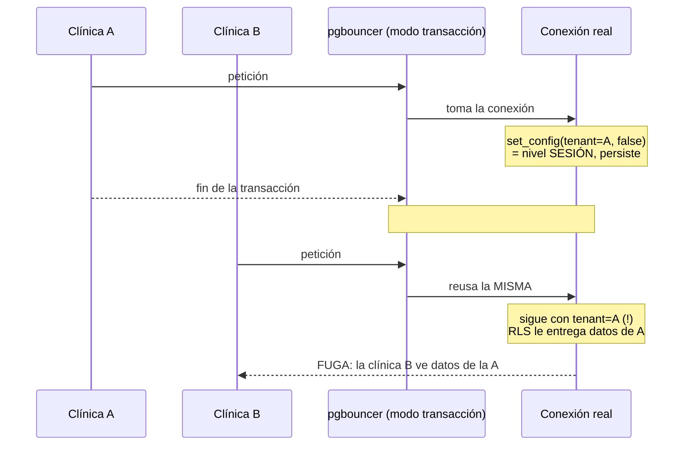

# pgbouncer + RLS — nota de escalabilidad (riesgo P0 #3)

> **Estado:** NO implementado · documento de referencia · 2026-06-29
>
> **Resumen en una línea:** pgbouncer hará falta para escalar a muchas réplicas sin
> agotar las conexiones de Postgres, **pero** en su modo eficiente (transacción)
> choca con nuestro aislamiento multi-tenant porque fijamos el tenant a nivel de
> **sesión** → riesgo de **fuga de datos entre clínicas**. Hay que migrar a
> `SET LOCAL` antes. **Hoy no es urgente** (1 réplica, vamos sobrados de conexiones).

---

## 1. ¿Qué problema resuelve pgbouncer?

Cada request a la base de datos usa una **conexión** (como una línea telefónica).
Postgres aguanta un número limitado (`max_connections`, ~100 por defecto). Al
escalar desplegamos **varias réplicas** del backend, y cada una abre sus propias
conexiones. La cuenta `N réplicas × hilos` puede superar el límite → Postgres
rechaza conexiones y la app falla justo con mucho tráfico.

### Sin pooler — el problema al escalar



> `N × 8` crece rápido y revienta el límite de ~100.

### Con pgbouncer — comparte pocas conexiones reales

pgbouncer es un **pooler**: se pone entre la app y Postgres, mantiene un **pool**
de pocas conexiones reales (p. ej. 20) y deja que muchas conexiones de la app las
**compartan**.



> Analogía: en vez de 200 empleados con línea directa al banco (que solo tiene 100
> líneas), una recepcionista con 20 líneas multiplexa a los 200.

---

## 2. El riesgo en nuestro multi-tenant (lo delicado)

El aislamiento entre clínicas se apoya en **RLS de Postgres** + una **variable de
contexto**. En cada request el middleware ejecuta:

```sql
set_config('app.current_tenant_id', <id de la clínica>, false)
```

El `false` = **nivel de SESIÓN**: la marca "soy la clínica A" dura **toda la
conexión**. RLS la lee con `current_tenant_id()` para mostrar solo los datos de esa
clínica.

pgbouncer en **modo transacción** (el eficiente) reutiliza la conexión real **por
cada transacción**, no por sesión. Combinado con una variable de **sesión**, una
conexión marcada "clínica A" puede acabar sirviendo a la "clínica B":



En una app médica esto es **gravísimo** (privacidad de pacientes, NOM-024). Por eso
el cambio se marca de **riesgo alto / estructural**: toca el núcleo del aislamiento.

---

## 3. El arreglo y sus modos

| Opción | Eficiencia | ¿Seguro con nuestro RLS? |
|---|---|---|
| pgbouncer **modo sesión** | Media (1 conexión por sesión de cliente) | ✅ Sí (compatible con el código actual) |
| pgbouncer **modo transacción** + variable de **sesión** (hoy) | Alta | 🔴 **No** — fuga entre clínicas |
| pgbouncer **modo transacción** + **`SET LOCAL`** | Alta | ✅ Sí (el arreglo correcto) |

**El arreglo:** cambiar `set_config(..., false)` (sesión) por **`SET LOCAL`** =
`set_config(..., true)` (transacción). Así el tenant se fija **por cada transacción**
y se borra al terminarla → cada transacción declara su propia clínica.

### Checklist para cuando se haga (sesión dedicada)

- [ ] Activar `ATOMIC_REQUESTS = True` (o envolver cada query en transacción): con
      `SET LOCAL` el tenant solo vive dentro de una transacción.
- [ ] Cambiar los 3 puntos que fijan el GUC a `SET LOCAL` (ver §5).
- [ ] Verificar que **ninguna** query corra fuera de transacción (quedaría sin tenant).
- [ ] Tests de **fuga**: simular pool compartido y confirmar que la clínica B nunca
      ve datos de la A. Es la prueba más importante.
- [ ] Recién entonces: meter pgbouncer en `docker-compose` en modo transacción.

---

## 4. ¿Cuándo hacerlo?

**Hoy NO.** Con 1 contenedor de backend, ~8 hilos y `CONN_MAX_AGE=60`, estamos
lejísimos del límite de Postgres.

Señales de que llegó el momento:
- Vas a correr **varias réplicas** del backend (escalado horizontal).
- Empiezas a ver errores tipo `FATAL: too many connections` o `remaining connection
  slots are reserved`.
- El monitor de Postgres muestra el nº de conexiones acercándose a `max_connections`.

---

## 5. Referencias en el código

| Qué | Dónde |
|---|---|
| Fija el GUC del tenant (sesión, `false`) | `apps/core/middleware.py:72`, `apps/core/views.py:116` |
| Limpia el GUC al final del request | `apps/core/middleware.py:87` |
| Función SQL `current_tenant_id()` (RLS) | `apps/tenancy/migrations/0002_enable_rls.py` |
| Reuso de conexiones `CONN_MAX_AGE` | `config/settings/base.py:141` |
| Riesgo original (reporte) | `docs/reports/metricas-refactor-huerfanos-escalabilidad.md` (P0 #3) |
