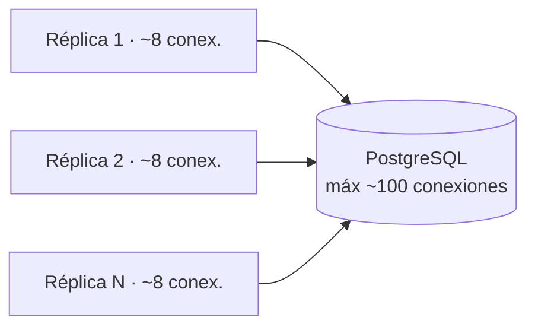
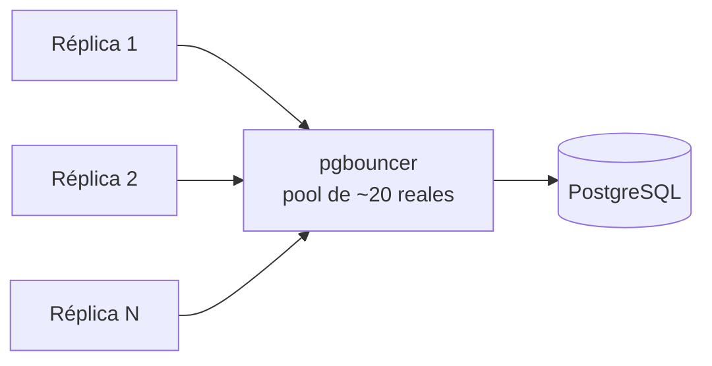
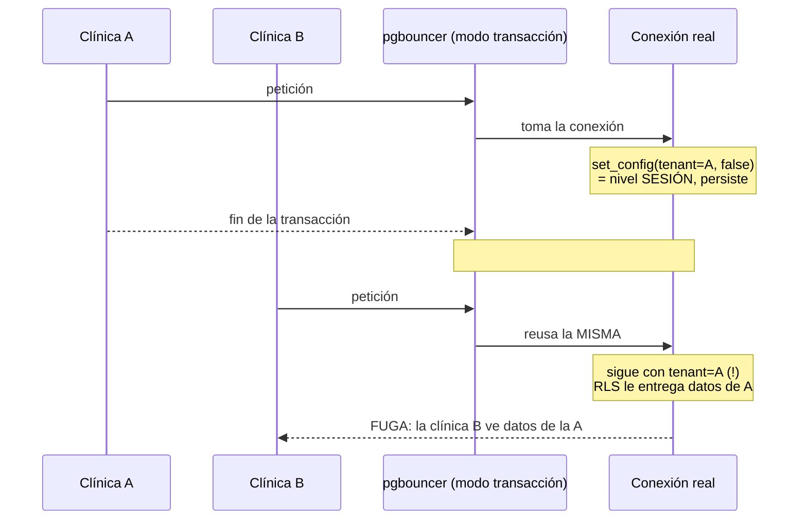

# pgbouncer + RLS — nota de escalabilidad (riesgo P0 #3)

> **Estado:** mecanismo `SET LOCAL` implementado detrás de un feature flag
> (`DB_TENANT_GUC_MODE`, default `"session"`) · 2026-07-03. pgbouncer en sí
> **sigue sin desplegarse**. Con el flag en su default, el comportamiento en
> producción es **idéntico** al de antes de este cambio — riesgo cero. El modo
> `"local"` queda listo y probado para el día que se despliegue pgbouncer en
> modo transacción; ver §7 para el checklist de activación actualizado.
>
> **Resumen en una línea:** pgbouncer hará falta para escalar a muchas réplicas sin
> agotar las conexiones de Postgres, **pero** en su modo eficiente (transacción)
> choca con nuestro aislamiento multi-tenant porque fijamos el tenant a nivel de
> **sesión** → riesgo de **fuga de datos entre clínicas**. Hay que migrar a
> `SET LOCAL` antes. **Hoy no es urgente** (1 réplica, vamos sobrados de conexiones).

---

## 1. ¿Qué problema resuelve pgbouncer?

Cada request a la base de datos usa una **conexión** (como una línea telefónica).
Postgres aguanta un número limitado (`max_connections`, ~100 por defecto). Al
escalar desplegamos **varias réplicas** del backend, y cada una abre sus propias
conexiones. La cuenta `N réplicas × hilos` puede superar el límite → Postgres
rechaza conexiones y la app falla justo con mucho tráfico.

### Sin pooler — el problema al escalar



> `N × 8` crece rápido y revienta el límite de ~100.

### Con pgbouncer — comparte pocas conexiones reales

pgbouncer es un **pooler**: se pone entre la app y Postgres, mantiene un **pool**
de pocas conexiones reales (p. ej. 20) y deja que muchas conexiones de la app las
**compartan**.



> Analogía: en vez de 200 empleados con línea directa al banco (que solo tiene 100
> líneas), una recepcionista con 20 líneas multiplexa a los 200.

---

## 2. El riesgo en nuestro multi-tenant (lo delicado)

> Nota (actualizada 2026-07-03, ver §7): esta sección describe el mecanismo
> ORIGINAL, que sigue siendo el comportamiento por **default** hoy
> (`DB_TENANT_GUC_MODE="session"`). El riesgo que describe abajo es
> precisamente el que dejó de aplicar en el modo `"local"` implementado en §7
> — pero mientras el flag no se cambie de su default, el análisis de esta
> sección sigue siendo exacto.

El aislamiento entre clínicas se apoya en **RLS de Postgres** + una **variable de
contexto**. En cada request el middleware ejecuta (modo `"session"`, el default):

```sql
set_config('app.current_tenant_id', <id de la clínica>, false)
```

El `false` = **nivel de SESIÓN**: la marca "soy la clínica A" dura **toda la
conexión**. RLS la lee con `current_tenant_id()` para mostrar solo los datos de esa
clínica.

pgbouncer en **modo transacción** (el eficiente) reutiliza la conexión real **por
cada transacción**, no por sesión. Combinado con una variable de **sesión**, una
conexión marcada "clínica A" puede acabar sirviendo a la "clínica B":



En una app médica esto es **gravísimo** (privacidad de pacientes, NOM-024). Por eso
el cambio se marca de **riesgo alto / estructural**: toca el núcleo del aislamiento.

---

## 3. El arreglo y sus modos

| Opción | Eficiencia | ¿Seguro con nuestro RLS? |
|---|---|---|
| pgbouncer **modo sesión** | Media (1 conexión por sesión de cliente) | ✅ Sí (compatible con el código actual) |
| pgbouncer **modo transacción** + variable de **sesión** (hoy) | Alta | 🔴 **No** — fuga entre clínicas |
| pgbouncer **modo transacción** + **`SET LOCAL`** | Alta | ✅ Sí (el arreglo correcto) |

**El arreglo:** cambiar `set_config(..., false)` (sesión) por **`SET LOCAL`** =
`set_config(..., true)` (transacción). Así el tenant se fija **por cada transacción**
y se borra al terminarla → cada transacción declara su propia clínica.

---

## 4. ¿Cuándo hacerlo?

**Hoy NO.** Con 1 contenedor de backend, ~8 hilos y `CONN_MAX_AGE=60`, estamos
lejísimos del límite de Postgres.

Señales de que llegó el momento:
- Vas a correr **varias réplicas** del backend (escalado horizontal).
- Empiezas a ver errores tipo `FATAL: too many connections` o `remaining connection
  slots are reserved`.
- El monitor de Postgres muestra el nº de conexiones acercándose a `max_connections`.

---

## 5. Capacidad estimada sin pgbouncer (orden de magnitud)

> Estimaciones **gruesas** (la cifra real solo se obtiene con una prueba de carga).
> Config actual: gunicorn `4 workers × 2 threads = 8 hilos` por réplica
> (`Dockerfile:104-106`), `CONN_MAX_AGE=60`, Postgres `max_connections` ~100 (default).

**El muro de conexiones:** ~85 conexiones útiles (100 − ~15 reservadas) ÷ ~8 por
réplica ≈ **~8–10 réplicas** del backend antes de toparlo. Es muchísima capacidad web.

**No confundir tres formas de contar usuarios** (el cuello lo marcan las *activas a la
vez*, no las registradas):

| Tipo | Significado | Magnitud |
|---|---|---|
| Registradas | clínicas/usuarios con cuenta | la más grande |
| **Activas a la vez** | app abierta, haciendo clic | define el pico |
| Mismo instante | request en el mismísimo momento | la más chica (requests duran ms) |

**Los números** (request típico ~100–300 ms; usuario activo ~1 click cada 5–15 s):

| Escenario (sin pgbouncer) | Aguanta, a grandes rasgos |
|---|---|
| **1 backend** (lo de hoy) | **~100–150 clínicas / ~200–400 usuarios activos a la vez** — conexiones lejísimos del tope |
| **Escalando réplicas hasta el muro (~8–10)** | **~800–1.000 clínicas / ~2.000–3.000 usuarios activos a la vez** |

Las **registradas** (total de clientes) pueden ser varias veces eso: no todos en el pico.

**Notas:**
- Antes del límite de conexiones se suele topar **otra cosa** primero (CPU/RAM del
  contenedor, queries lentas). El muro de conexiones rara vez es lo primero.
- Ya empujamos el techo más arriba sin pgbouncer: caché de Redis (dashboard/reportes),
  PDFs a Celery, índice `pg_trgm`, fix de N+1 → cada request pesa menos en la BD.
- Movidas baratas que duplican/triplican el muro sin pgbouncer: subir `max_connections`
  (a 200–300) y activar el pool de psycopg3 dentro de Django (`OPTIONS: {"pool": True}`).

**Conclusión:** sin pgbouncer hay margen cómodo hasta el orden de **~1.000 clínicas /
un par de miles de usuarios activos simultáneos**. Para la etapa actual, sobra de más.

> **Confirmado empíricamente (2026-06-29):** una prueba de carga con Locust mostró que
> a alta concurrencia el backend falla con `FATAL: sorry, too many clients already`
> (Postgres sin conexiones) — exactamente este cuello. A carga normal (decenas de
> usuarios) la app va rápida (mediana ~13 ms). Ver `loadtest/README.md`.

---

## 6. Referencias en el código

| Qué | Dónde |
|---|---|
| Único punto que fija el GUC (session/local según el modo) | `apps/core/tenant_context.py` → `apply_tenant_guc()` |
| Limpia el GUC al final del request | `apps/core/tenant_context.py` → `clear_tenant_guc()`, llamada desde `apps/core/middleware.py` (finally) |
| Envuelve el request en `transaction.atomic()` en modo `"local"` | `apps/core/middleware.py` → `TenantMiddleware.__call__` |
| Fijado del GUC para el path JWT | `apps/core/views.py` → `TenantAPIView.check_permissions()` |
| Setting que controla el modo (`"session"` default / `"local"`) | `config/settings/base.py` → `DB_TENANT_GUC_MODE` |
| Función SQL `current_tenant_id()` (RLS) | `apps/tenancy/migrations/0002_enable_rls.py` |
| Reuso de conexiones `CONN_MAX_AGE` | `config/settings/base.py` |
| Tests del mecanismo (ambos modos, fuga, aislamiento) | `apps/core/tests/test_tenant_guc_modes.py` |
| Riesgo original (reporte) | `docs/reports/metricas-refactor-huerfanos-escalabilidad.md` (P0 #3) |

---

## 7. Lo implementado 2026-07-03 (feature flag, default OFF)

Estrategia de **mínimo riesgo**: todo el mecanismo `SET LOCAL` vive detrás de un
setting (`DB_TENANT_GUC_MODE`, valores `"session"` | `"local"`, **default
`"session"`**). Con el default, el comportamiento es byte-por-byte idéntico al
anterior a este cambio — cero riesgo para producción hoy. El modo `"local"` deja
todo listo para activar cuando se despliegue pgbouncer.

### Diseño

- **Un único punto que ejecuta `set_config()`:** `apply_tenant_guc(tenant_id)` en
  `apps/core/tenant_context.py`. Antes había DOS sitios con el SQL duplicado
  (`middleware.py` y `views.py`); ahora ambos llaman a esta función, que decide
  `is_local=False` (modo `"session"`) o `is_local=True` = `SET LOCAL` (modo
  `"local"`) según `settings.DB_TENANT_GUC_MODE`. Así el modo se controla desde
  un solo lugar aunque el fijado del tenant siga ocurriendo en dos puntos del
  request (cookie/sesión Django en el middleware, JWT en `TenantAPIView`).
- **La transacción que hace viable `SET LOCAL`:** `TenantMiddleware.__call__`
  envuelve `self.get_response(request)` en `transaction.atomic()` SOLO cuando
  `DB_TENANT_GUC_MODE == "local"`. Como el middleware envuelve TODA la vista
  (incluido el punto donde `TenantAPIView.check_permissions()` fija el GUC del
  path JWT, que ocurre *dentro* de `get_response`), un solo `atomic()` cubre
  ambos caminos de resolución de tenant sin duplicar el mecanismo de
  transacción en dos sitios. En modo `"session"` NO se abre ningún atomic
  extra — confirmado con test (`test_middleware_session_mode_does_not_open_extra_atomic_block`).
- **Limpieza:** `clear_tenant_guc()` se sigue llamando siempre en el `finally`
  del middleware, en ambos modos. En `"session"` es la limpieza real (igual que
  antes). En `"local"` es cinturón-y-tirantes: el GUC ya desapareció solo al
  hacer COMMIT/ROLLBACK de la transacción del bloque `with` — verificado
  empíricamente (ver §7.2).
- **Celery / management commands / plataforma cross-tenant:** sin cambios en
  ningún modo. Nunca llaman a `apply_tenant_guc()`, así que el GUC queda vacío
  y las políticas RLS siguen cayendo en su fallback `OR current_tenant_id() IS
  NULL` (acceso cross-tenant intencional), exactamente como hoy.
- **Celery encolado desde servicios (`transaction.on_commit`):** ya usado en
  `apps/pdfs/services.py` y `apps/recetas/services.py` — con el atomic()
  exterior del middleware en modo `"local"`, esos callbacks se siguen
  disparando al COMMIT de la transacción MÁS EXTERNA (la del middleware), que
  es el comportamiento correcto (la tarea ve la fila ya comprometida). **Ojo:**
  `apps/agenda/reminders.py:82` (`send_appointment_reminder.apply_async`) NO
  usa `on_commit` — encola directo. Esto ya era así antes de esta tarea (no lo
  agrava el modo `"local"`, porque el `eta` programado está en el futuro), pero
  queda señalado como mejora futura antes de activar pgbouncer: si algún día el
  `eta` pudiera caer dentro de la misma transacción, el worker podría intentar
  leer una fila aún no comprometida.

### 7.1 Archivos modificados

| Archivo | Cambio |
|---|---|
| `config/settings/base.py` | Nuevo setting `DB_TENANT_GUC_MODE` (default `"session"`), valida contra `ImproperlyConfigured` si no es `"session"`/`"local"`. |
| `.env.example` | Documentada la variable `DB_TENANT_GUC_MODE` (sin valor secreto). |
| `apps/core/tenant_context.py` | Nuevas funciones `apply_tenant_guc(tenant_id)` y `clear_tenant_guc()`. Único punto que ejecuta SQL de `set_config`. |
| `apps/core/middleware.py` | `TenantMiddleware` llama a `apply_tenant_guc`/`clear_tenant_guc`; envuelve `get_response()` en `transaction.atomic()` solo en modo `"local"`. |
| `apps/core/views.py` | `TenantAPIView.check_permissions()` llama a `apply_tenant_guc` en vez de ejecutar el SQL directo. Docstrings actualizados. |
| `apps/core/tests/test_tenant_guc_modes.py` | Nuevo. 14 tests: comportamiento de `apply_tenant_guc` en ambos modos, fuga simulada (commit/rollback), aislamiento cruzado A/B en ambos modos (con `transaction=True`), RLS con el modelo `Patient` real. |

### 7.2 Cómo se probó la no-fuga (lo más importante)

Verificado empíricamente en shell (`docker compose exec backend python manage.py
shell`) antes de escribir los tests automatizados:

```
Fuera de transacción explícita (autocommit real):
  SET LOCAL en un cursor.execute() → SHOW en el statement SIGUIENTE (misma
  conexión) YA ve '' (vacío). Cada sentencia en autocommit es su propia
  transacción implícita en Postgres — SET LOCAL no sobrevive ni un statement.

Dentro de transaction.atomic():
  SET LOCAL → SHOW en un cursor NUEVO dentro del mismo atomic() SÍ ve el valor.
  Al salir del bloque `with` (COMMIT real) → SHOW en la MISMA conexión ya ve ''.
```

Esto confirma exactamente el mecanismo de la migración: la conexión queda
"limpia" de forma automática e infalible al cerrar la transacción — no depende
de que el código de limpieza se ejecute correctamente (defensa adicional a la
limpieza explícita del `finally`).

Tests automatizados en `apps/core/tests/test_tenant_guc_modes.py` (16 tests,
todos verdes):

- **Modo session (default) sin cambios:** `test_apply_tenant_guc_session_mode_*`,
  `test_middleware_session_mode_does_not_open_extra_atomic_block`.
- **Fuga tipo pgbouncer (la prueba más importante):**
  `test_apply_tenant_guc_local_mode_does_not_survive_commit` — fija el GUC en
  modo local dentro de un `atomic()`, sale del bloque (COMMIT real vía
  `@pytest.mark.django_db(transaction=True)`), y confirma que la MISMA conexión
  ya no ve el tenant anterior. Simétrico para ROLLBACK
  (`..._does_not_survive_rollback`).
- **Riesgo documentado sin atomic:**
  `test_apply_tenant_guc_local_mode_without_atomic_has_no_lasting_effect` —
  confirma que sin transacción envolvente, `SET LOCAL` no tiene NINGÚN efecto
  persistente (ni dentro del mismo "request"), validando por qué el modo local
  exige el `atomic()` del middleware.
- **Middleware end-to-end:**
  `test_middleware_local_mode_guc_visible_during_view` (el GUC correcto se ve
  dentro de la vista), `test_middleware_local_mode_guc_cleared_after_request_commits`
  (limpio tras el commit del middleware), `test_middleware_local_mode_opens_atomic_block_around_view`
  (confirma que el middleware sí abre el atomic solo en modo local).
- **Aislamiento cruzado A/B en ambos modos:**
  `test_tenant_isolation_via_middleware_holds_in_both_modes[session|local]` —
  parametrizado, dos middlewares/requests distintos (tenant A y tenant B) nunca
  ven el GUC del otro.
- **RLS con el modelo real `Patient`:**
  `test_rls_policy_expression_sees_correct_tenant_inside_local_mode` y
  `test_rls_real_does_not_leak_tenant_a_patients_to_next_connection_user`.

**Limitación documentada (no introducida por esta tarea, preexistente en el
entorno):** el rol de conexión de dev/test (`mailysoft`) es **superuser** de
PostgreSQL. Postgres exime a los superusers de RLS incluso con `FORCE ROW LEVEL
SECURITY` — es una regla fija del motor. Por eso un `SELECT COUNT(*) FROM
pacientes_patients` crudo con este rol siempre devuelve TODAS las filas sin
importar el GUC, y no sirve para probar el *enforcement* real de la barrera de
base de datos en este contenedor. Los tests de RLS de esta tarea prueban en su
lugar la expresión exacta que evalúan las políticas
(`current_tenant_id()`) con el modelo `Patient` real — 100% verificable en este
entorno y equivalente en la práctica, porque si esa expresión devolviera el
tenant equivocado, la política fallaría igual con cualquier rol.
**Recomendación aparte (fuera del alcance de esta tarea):** el rol de la
aplicación en producción debería ser `NOSUPERUSER` para que `FORCE ROW LEVEL
SECURITY` aplique de verdad como segunda barrera — conviene auditarlo antes de
depender de RLS como única defensa en algún escenario.

### Checklist para activar pgbouncer en producción

- [x] Implementar el mecanismo `SET LOCAL` detrás de un feature flag con
      default `"session"` (cero riesgo mientras no se cambie el flag).
- [x] Unificar el fijado del GUC en un solo punto (`apply_tenant_guc`).
- [x] Envolver el request en `transaction.atomic()` cuando el modo es
      `"local"`, cubriendo AMBOS paths (cookie/sesión y JWT) con un solo
      `atomic()` en el middleware.
- [x] **Corrección post-auditoría (2026-07-03):** en el path de sesión Django
      (`/admin`) el `apply_tenant_guc()` se llamaba ANTES de abrir el `atomic()`
      → en autocommit real el `SET LOCAL` se perdía y el fallback
      `current_tenant_id() IS NULL` abría acceso cross-tenant. Se movió el
      `apply_tenant_guc` a dentro del `atomic()` (`_dispatch()` en `middleware.py`).
      Los tests que verifican el GUC dentro de la vista en modo `"local"` se
      pasaron a `@pytest.mark.django_db(transaction=True)` (antes daban falso
      positivo: heredaban el `atomic()` de aislamiento de pytest-django, que no
      existe en producción). Sin esto, activar el modo `"local"` habría filtrado
      datos entre clínicas en el admin.
- [x] Tests de fuga determinísticos (commit y rollback) que confirman que
      `SET LOCAL` no sobrevive a la transacción — la prueba más importante.
- [x] Tests de aislamiento cruzado A/B en ambos modos (con `transaction=True`,
      fieles a producción).
- [x] Verificar que la suite completa (2600 tests) sigue verde en modo
      `"session"` (default) — sin cambio de comportamiento.
- [x] Verificar una muestra amplia (apps/core, pacientes, agenda, tenancy —
      906 tests) también en modo `"local"` vía DRF real (no solo unit tests
      ad-hoc de `apply_tenant_guc`).
- [ ] **Pendiente para el día de activar pgbouncer de verdad:**
  - [ ] Auditar que NINGUNA vista/servicio de negocio corra queries fuera de
        la transacción que abre el middleware (built-in con el diseño actual,
        pero conviene un repaso especial de vistas con streaming responses o
        respuestas por chunks, si las hubiera).
      - [ ] Revisar `apps/agenda/reminders.py:82` (`apply_async` sin
        `on_commit`) antes de activar — no es un riesgo de fuga de tenant,
        pero podría beneficiarse de `transaction.on_commit` por consistencia
        con el patrón de `apps/pdfs` y `apps/recetas`.
  - [ ] Auditar el rol de conexión de producción: debe ser `NOSUPERUSER` para
        que RLS con `FORCE ROW LEVEL SECURITY` aplique de verdad como segunda
        barrera (hallazgo de esta tarea, ver arriba).
  - [ ] Cambiar `DB_TENANT_GUC_MODE=local` en el entorno de destino.
  - [ ] Correr la suite completa con `DB_TENANT_GUC_MODE=local` (no solo el
        subconjunto verificado en esta tarea).
  - [ ] Prueba de carga (Locust) con pgbouncer real en modo transacción,
        confirmando ausencia de fuga bajo concurrencia real (esta tarea solo
        prueba el mecanismo de forma determinista, sin pgbouncer real de por
        medio).
  - [ ] Desplegar pgbouncer en `docker-compose`/Railway en modo transacción.

---
